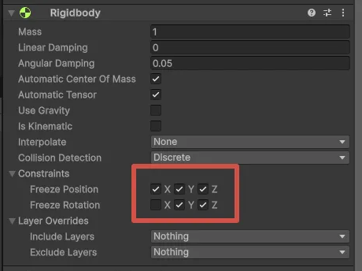

# Лабораторная работа №1

2.3

Оба куба упадут на землю одновременно. Хоть у них и разная масса (1 кг и 100 кг), это не влияет на скорость падения. В Unity все объекты падают с одинаковым ускорением и гравитацией. То есть тяжёлый и лёгкий куб падают одинаково, если нет сопротивления воздуха. Поэтому они коснутся земли в одно и то же время.

2.7 
- Тестирование столкновения с кубами разной массы:
    - Когда сфера сталкивается с кубом массой 1 кг, куб обычно сдвигается, так как он легкий, и сфера может его переместить.
    - Когда сфера сталкивается с кубом массой 100 кг, куб почти не двигается, потому что его масса намного больше массы первого куба, и массы у сферы и этого куба равны.
- Влияние параметра Drag:
    - Параметр Drag влияет на скорость сферы. Если Drag высокий, сфера будет замедляться быстрее, и ее движение по эстакаде будет медленнее, а значит и удар по кубу будет менее сильным.
    - Если Drag маленький или его нет, сфера будет двигаться быстрее, так как сопротивление воздуха будет меньше.

2.9

Когда Drag и Angular Drag равны нулю, объект будет двигаться и вращаться без замедления, то есть будет двигаться и вращаться свободно, пока не воздействуют внешние силы. Если задать значения Drag и Angular Drag равными 2, объект начнёт замедляться как при движении, так и при вращении. Это важно для имитации эффектов сопротивления воздуха или трения, которые замедляют движение и вращение объектов. Angular Drag равный 0 означает, что объект будет продолжать вращаться бесконечно, не теряя скорости, если на него не будут воздействовать внешние силы.

2.11 

При значении Physics -500 куб с массой 100 кг проходит через Ground, а при значении -8000 он проходит через Stage, поскольку обработчик не успевает зафиксировать столкновение этих объектов.

2.13

2.14

Если отключить галочку с isKinematic во время работы сцены, объект перестанет быть нефизическим. Платформа не будет продолжать вращение, так как на неё больше не будет воздействовать физическая симуляция после снятия этой галочки (если только не были изменены параметры заморозки, такие как freeze). То есть вращение остановится, потому что объект вернется под управление физикой, и его движение зависит от внешних сил и воздействия.

2.15

Куб проходит через землю из-за того, что физика не успевает обработать столкновение, так как не хватает времени, чтобы рассчитать взаимодействие и остановить куб. Чтобы решить эту проблему, нужно настроить режимы обнаружения столкновений для компонента RigidBody. Для объектов, двигающихся с большой скоростью, следует использовать ContinuousDynamic в настройках CollisionDetectionMode. Если столкновение происходит между двумя быстро движущимися объектами (например, пулями или автомобилями), выберите режим Continuous. Эти изменения могут повлиять на производительность системы физики.

2.17

Знания о компонентах RigidBody в Unity помогут создавать более реалистичные физические взаимодействия объектов в играх и симуляторах. Например, можно настроить массу, трение и гравитацию, чтобы объекты двигались и сталкивались естественно. Также важно понимать, как правильно настроить обнаружение столкновений, чтобы избежать проблем, таких как прохождение объектов сквозь другие. Это позволяет сделать игру или симулятор более точным и увлекательным.
